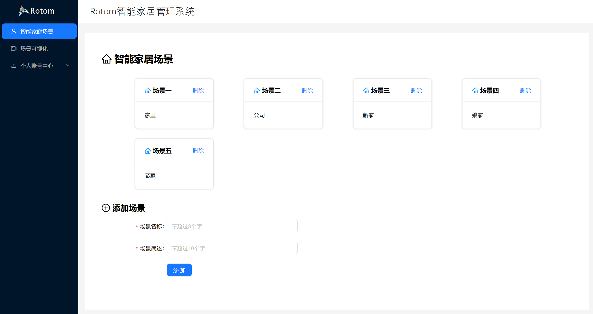
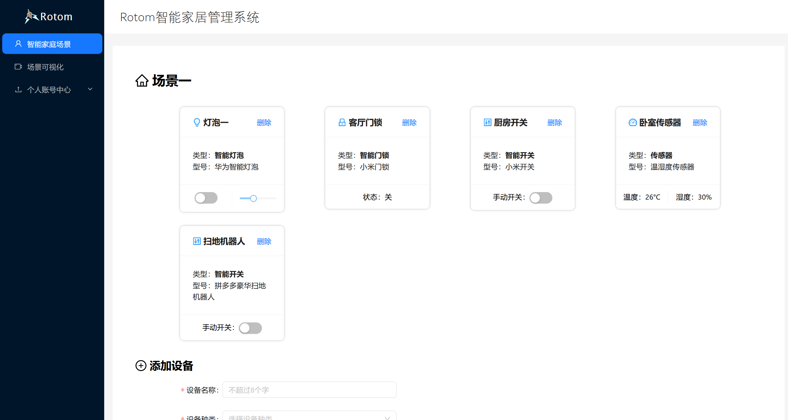
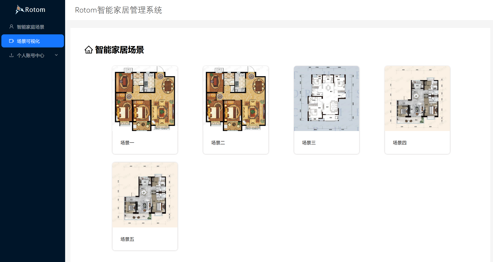
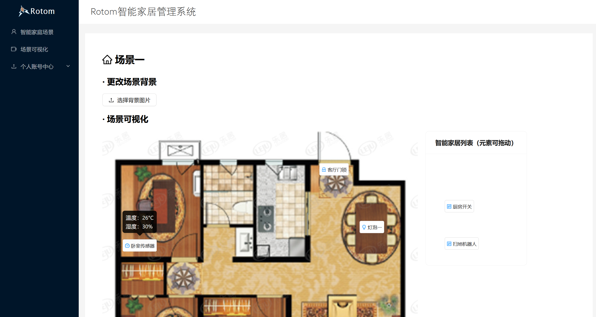

# Rotom智能家居管理系统
### BS大作业

+ 前端框架：react
+ 后端框架：django
+ 项目地址：https://github.com/relat-ivity/Rotom-system.git


#### 端口

PC端前端：http://localhost:3000

手机端前端：http://localhost:9000（修改请求基地址在```src/index.js```中修改```base_url```）

后端：http://localhost:8000


#### 运行

fork项目 ```git clone https://github.com/relat-ivity/Rotom-system.git ```

1. 前端

```shell
cd frontend	//移动端是frontend-mobile
npm install
npm start
```

2. 后端（推荐使用pycharm）

```shell
cd backend
pip install -r 'requirements.txt'
py manage.py runserver
```


#### 界面













